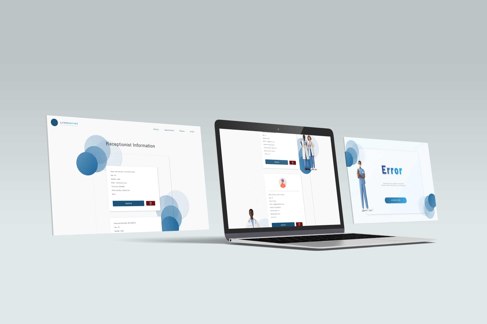

# LiveSaving 

<!-- Repository Information & Links-->
<br />


<!-- HEADER SECTION -->
<h5 align="center" style="padding:0;margin:0;">Clarisse Strijdom</h5>
<h5 align="center" style="padding:0;margin:0;">21100249</h5>
<h6 align="center">DV200 - Term 2 | 2023</h6>
</br>
<p align="center">

  <a href="https://github.com/YourName/NameOfRepo">
    
  </a>
  
  <h3 align="center">LifeSaving</h3>

  <p align="center">

A website that allows access to multiple receptionists from a doctors room to login. Our website was build to authenticate, validate and secure receptionist profiles. Add and stor patient and doctor information. Update, delete patient and doctor information. Update current logged in receptionist profile. Setup and delete appointments between doctors, patients and doctor rooms. Our website should also showcase "todays"or "this weeks"appointments. 
 
<!-- TABLE OF CONTENTS -->

## Table of Contents

* [About the Project](#about-the-project)
  * [Project Description](#project-description)
  * [Built With](#built-with)
* [Getting Started](#getting-started)
  * [Prerequisites](#prerequisites)
  * [How to install](#how-to-install)
* [Features and Functionality](#features-and-functionality)
* [Concept Process](#concept-process)
   * [Ideation](#ideation)
   * [Wireframes](#wireframes)
   * [Custom UI](#user-flow)
* [Development Process](#development-process)
   * [Implementation Process](#implementation-process)
        * [Highlights](#highlights)
        * [Challenges](#challenges)
   * [Future Implementation](#peer-reviews)
* [Final Outcome](#final-outcome)
    * [Mockups](#mockups)
    * [Video Demonstration](#video-demonstration)
* [Conclusion](#conclusion)
* [License](#license)
* [Contact](#contact)
* [Acknowledgements](#acknowledgements)

<!--PROJECT DESCRIPTION-->
## About the Project
<!-- header image of project -->


### Project Description


 Our brief challenged us to use PHP and MySQL to fundementally build a website that allows access to multiple receptionists to login. Our website was build to authenticate, validate and secure receptionist profiles. Add and stor patient and doctor information. Update, delete patient and doctor information. Update current logged in receptionist profile. Setup and delete appointments between doctors, patients and doctor rooms. Our website should also showcase "todays"or "this weeks"appointments. 

### Built With

* HTML - Hypertext Markup Language
* CSS - Cascading Style Sheets
* JS - JavaScript
* PHP - Hypertext Preprocessor
* MySQL - Structured Query Language

<!-- GETTING STARTED -->
<!-- Make sure to add appropriate information about what prerequesite technologies the user would need and also the steps to install your project on their own mashines -->
## Getting Started

The following instructions will get you a copy of the project up and running on your local machine for development and testing purposes.

### Prerequisites

Ensure that you have the latest version of [NPM](https://www.npmjs.com/) installed on your machine. The [GitHub Desktop](https://desktop.github.com/) program will also be required.

### How to install

### Installation
Here are a couple of ways to clone this repo:

1. GitHub Desktop </br>
Enter `https://github.com/CSWilder02/21100249_ClarisseStrijdom_DV200_T2_FinalProject.git` into the URL field and press the `Clone` button.

2. Clone Repository </br>
Run the following in the command-line to clone the project:
   ```sh
   git clone https://github.com/CSWilder02/21100249_ClarisseStrijdom_DV200_T2_FinalProject.git
   ```
    Open `Software` and select `File | Open...` from the menu. Select cloned directory and press `Open` button

4. An API key is not required


<!-- FEATURES AND FUNCTIONALITY-->
<!-- You can add the links to all of your imagery at the bottom of the file as references -->
## Features and Functionality

<!-- note how you can use your gitHub link. Just make a path to your assets folder -->


### Create
This feature allows all receptionists to create new doctor's accounts as well as patient and patient/doctor's appointments.


### Delete
This feature allows all receptionists to delete doctor's accounts as well as patient and patient/doctor's appointments.


### Update
This feature allows all receptionists to update all information in doctor's accounts as well as patient and patient/doctor's appointments.
Only the Head receptionist can however update, create or delete receptionist accounts.


### Upload 
This feature allow new data to be uploaded from the website into our database. Such as information, appointments or images.

### Login 
Using localStorage we setup a login page that stores all receptionist information so that if the wrong informatuion is used for login it will take the user to the error page.


<!-- CONCEPT PROCESS -->
<!-- Briefly explain your concept ideation process -->
<!-- here you will add things like wireframing, data structure planning, anything that shows your process. You need to include images-->
## Concept Process

The `Conceptual Process` is the set of actions, activities and research that was done when starting this project. Starting this project we had a set brief that we had to stick with creating our project. With this we had activities and self study homework to do in order to understand PHP and MySQL. We studied on what it means and how to use these funstionalities of PHP. 

### Ideation
On my planning I did research on some medical websites to create a new and unique style to my webiste and make it easy to use and accessible for all users. 


<br>


### Custom UI
Using the color blue is a symbol of the medical industry. I used medical staff illustration to create a more friendly visual design for my application.


#### Highlights
<!-- stipulated the highlight you experienced with the project -->
* Some highlights from my project:
1. I learned how toupload information from a website onto a database
2. Learning how an ER diagram setup and how to link it

#### Challenges
<!-- stipulated the challenges you faced with the project and why you think you faced it or how you think you'll solve it (if not solved) -->
* Challenges faced:
1. Image implementation, onhow to upload images and store them into your files aswell as the database.


### Future Implementation
<!-- stipulate functionality and improvements that can be implemented in the future. -->

* In future I would like to focus  on doiing more self study work to be able to implement more features and UI designs to my webistes and application. I want to focus on creating more visually plesant design and more interactivity when it comes to my websites.

<!-- MOCKUPS -->
## Final Outcome

### Mockups


<br>


<!-- VIDEO DEMONSTRATION -->
### Video Demonstration

To see a run through of the application, click below:

[View Demonstration]([pokemonproject/src/Assets/video/demonstration.mp4](https://youtu.be/VuDZCh7JjUE))


See the [open issues](https://github.com/YourName/Pokemon/issues) for a list of proposed features (and known issues).

<!-- AUTHORS -->
## Authors

* **CS Strijdom** - [CS Strijdom](https://github.com/CSWilder02)

<!-- LICENSE -->
## License

Distributed under the MIT License. See `LICENSE` for more information.\

<!-- LICENSE -->
## Contact

* **CS Strijdom** - [21100249@virtualwindow.co.za](mailto:21100249@virtualwindow.co.za) 
* **Project Link** - https://github.com/CSWilder02/21100249_ClarisseStrijdom_DV200_T2_FinalProject

<!-- ACKNOWLEDGEMENTS -->
## Acknowledgements
<!-- all resources that you used and Acknowledgements here -->
<!-- * [Resource Name](path/to/resource)
* [Resource Name](path/to/resource)
* [Resource Name](path/to/resource)
* [Resource Name](path/to/resource)
* [Resource Name](path/to/resource) -->

 
